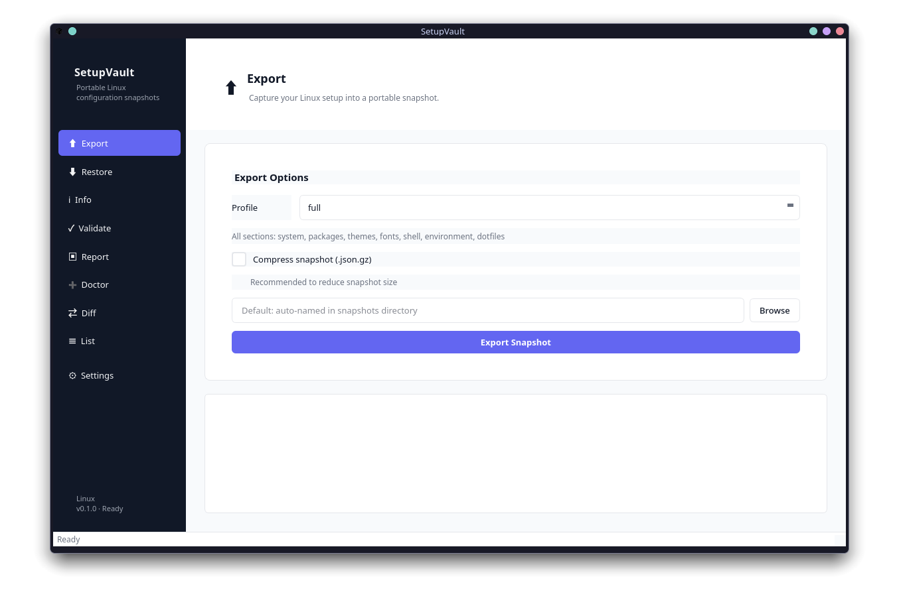

# SetupVault

Cross-distribution Linux setup backup, migration, restoration, and sharing tool.



## Features

- **Export** — capture system configuration (packages, dotfiles, services) into a portable JSON snapshot
- **Restore** — apply a snapshot on the same or a different distribution (cross-distro package mapping built-in)
- **Validate** — check snapshots for schema correctness and semantic issues
- **Report** — generate human-readable reports in Markdown, JSON, or HTML
- **Diff** — compare two snapshots to see what changed
- **Doctor** — run environment diagnostics to verify the tool is ready
- **Third-party package detection** — identify packages installed outside the official repositories
- **HTML reports** — standalone self-contained HTML pages with embedded CSS
- **Dotfile full backup** — file contents stored as base64 inside the snapshot

Supported distributions: Arch Linux, Debian, Fedora, Ubuntu, openSUSE.

## Installation

```bash
pip install setupvault
```

For the GUI:

```bash
pip install "setupvault[gui]"
```

### Development

```bash
git clone <repo>
cd setupvault
python -m venv .venv && source .venv/bin/activate
pip install -e ".[gui,dev]"
```

## Usage

### CLI

```bash
setupvault --help
setupvault export --profile full
setupvault restore /path/to/snapshot.json
setupvault info /path/to/snapshot.json
setupvault validate /path/to/snapshot.json
setupvault report /path/to/snapshot.json --format html
setupvault doctor
setupvault diff left.json right.json
setupvault list
```

### GUI

```bash
setupvault gui
# or
setupvault-gui

# With a specific theme:
setupvault gui --style dark
```

The GUI provides the same functionality through a point-and-click interface with sidebar navigation, persistent settings (theme, accent color, density), and keyboard shortcuts (Ctrl+1..9).

### Keyboard shortcuts

| Shortcut | Panel |
|----------|-------|
| Ctrl+1 | Export |
| Ctrl+2 | Restore |
| Ctrl+3 | Info |
| Ctrl+4 | Validate |
| Ctrl+5 | Report |
| Ctrl+6 | Doctor |
| Ctrl+7 | Diff |
| Ctrl+8 | List |
| Ctrl+9 | Settings |

## Development

```bash
# Lint
ruff check src/ tests/

# Format
ruff format src/ tests/

# Type check
mypy src/ --strict

# Test (CLI + core)
python -m pytest tests/ --ignore=tests/gui/ -v

# Test (GUI only, headless)
QT_QPA_PLATFORM=offscreen python -m pytest tests/gui/ -v

# All tests
python -m pytest tests/ -v
```

## Project structure

```
src/setupvault/
  cli/           CLI commands and argument parsing
  core/          Domain models (snapshot, package, system, dotfile)
  distro_adapters/  Distribution-specific logic (pacman, apt, dnf, zypper)
  storage/       Snapshot read/write (JSON, gzip)
  services/      Business logic (export, restore, validate, etc.)
  reports/       Report generation (markdown, json, html)
  doctor/        Environment diagnostics
  gui/           PySide6 graphical interface
    panels.py    Command panels (Export, Restore, Info, Validate, etc.)
    mainwindow.py Sidebar navigation, status bar, theme management
    styles.py    Light/dark theme definitions and QSS generation
    settings.py  Persisted GUI preferences
    widgets.py   Reusable widgets (FilePicker, ComboField, LoadingIndicator, HtmlViewer)
    worker.py    QThread-based async worker
```

## License

MIT
